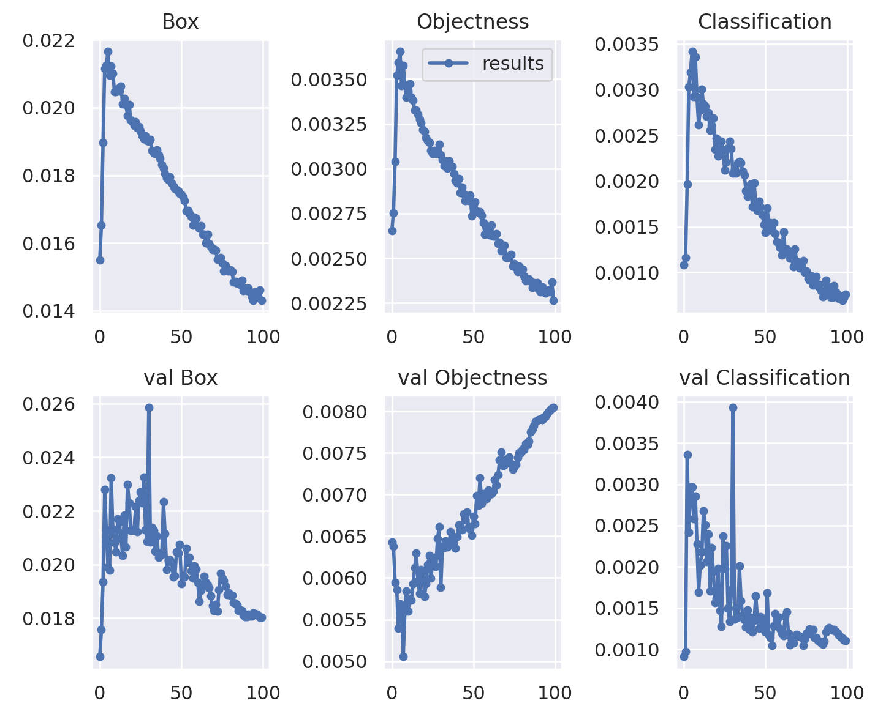

# Object detector for garbage recycling
In this Project we are trying to train and test a model for detecting various objects for recycling on the conveyor belt. In order to detect objects we have used <a href="https://github.com/WongKinYiu/yolov7">Yolov7</a> model which is fast and accurate enough for our intention.

# Dataset preparation
* The dataset used here is the <a href = "https://www.kaggle.com/datasets/arkadiyhacks/drinking-waste-classification" > Kaggle dataset </a> which has 4 classes (Aluminium, Glass, PET, HDPE). It consists of over 4700 images of objects which are photographed on various backgrounds. The dataset is annotated as below:
(object-class-ID) (X center) (Y center) (Box width) (Box height)

* Data is divided into trainset (3.5k), test set (475), and validation set (718).
* In the preprocessing stage, data has been resized to 416x416 pixels.
* In order to augment the new dataset, the <a href= "https://roboflow.com"> Roboflow </a> website has been used. Augmentation is done in two fashions. First, the images have been rotated 15 degrees and then some of them have been blurred and infused into the dataset. 

# Training Process
Yolov7 has been used to train our model and the weights in .pt and .onnx format are downloaded and given in Weights folder.

First of all clone our respository and install requirements:
```
$ git clone https://github.com/RecycleAI/RecycleIT-A.git
$ cd ./RecycleIT-A/src/tools/models/Yolov7/'v2- 100 epochs - kaggle dataset - 8 batchsize'
$ pip install -r requirements.txt
```

The parameters for training are set as below:
| Model | epochs | batch size | img size | weights | workers | hyp |
| :-- | :-: | :-: | :-: | :-: | :-: | :-: |
| **YOLOv7** | 640 | 8 | 416*416 | pretrained_yolo7.pt | 8 | hyp.scratch.p5.yaml
|  |  |  |  |  |  |

The pretrained weights are obtained in <a href="./Weights" > Weights</a> folder.
Here is the process of training which you can try yourself.

The dataset here has been obtained from Roboflow and is used as below:
```
!pip install roboflow

from roboflow import Roboflow
rf = Roboflow(api_key="pQ87Iksv2e5pdUTxwNf8")
project = rf.workspace("recycle-2uipy").project("recycle-w2o7u")
dataset = project.version(3).download("yolov7")
```
Run the code below in order to train your model:
```
$ cd yolov7
$ python train.py --epochs 100 --batch-size 8 --img 416 416 --data {dataset.location}/data.yaml --cfg cfg/training/yolov7.yaml --weights '../Weights/pretrained_yolo7.pt' --device 0 --name yolov7 --workers 8 --hyp data/hyp.scratch.p5.yaml
```
# Training Results
The Code below will show the results of training.
```
from utils.plots import plot_results
Image(filename='runs/train/yolov7/results.png', width=1000) 
```
Here are results of model training.
* Losses
<div align="center">
    <a href="./">
        
    </a>
</div>

* Metrics
<div align="center">
    <a href="./">
        
    </a>
</div>

* Final mAp
<div align="center">
    <a href="./">
        
    </a>
</div>

Each class number is refered to a class in dataset which is listed below:

| Classes | 0 | 1 | 2 | 3 |
| :-- | :-: | :-: | :-: | :-: |
|  | **Aluminium** | **Glass** | **HDPE** | **PET**|
|  |  |  |  |  |  |

# Detecting Process
In order to detect new objects set --source to your test image path and run it.
```
$ cd yolov7
$ python detect.py --weights '../Weights/best_yolov7.pt' --img 416 --conf 0.1 --source '../Figures/test_object.jpg'
```
The result will be as below:
<div align="center">
    <a href="./">
        
    </a>
</div>

# Exporting
In order to export .pt file as onnx format run the code below:
```
$cd ..
$python export.py --weights 'Weights/best_yolov7.pt
```